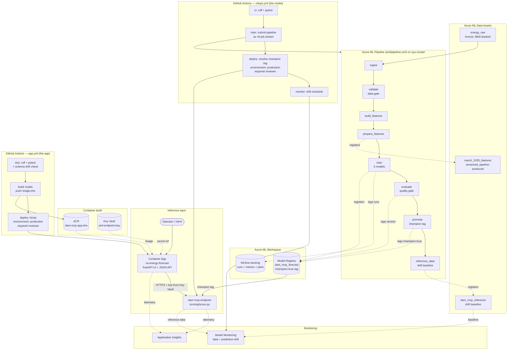

# Architecture — Azure MLOps for Energy Market Forecasting

This document maps the source (local/GCP-style) MLOps stack onto Azure services
and explains the data + control flow.

## End-to-end flow



## Component-by-component mapping

### Orchestration — DVC → Azure ML Pipeline
The source `dvc.yaml` declared stages (`prepare_feast_data → train → evaluate →
promote`) with file deps/outs and `dvc repro` for incremental runs. Here each
stage is an **Azure ML command component** (`aml/components/*.yml`) wired into a
**pipeline job** (`aml/pipeline.yml`). AML gives the same DAG + caching
(`force_rerun: false` reuses unchanged step outputs) but runs on managed compute
and records full lineage in the studio.

Because `train` writes to the *registry* (not a file the next step reads),
`evaluate` and `promote` are ordered with explicit **signal edges** — they
consume the prior step's output folder purely to force execution order (see the
`--train-signal` / `--eval-signal` passthrough args).

### Tracking & registry — local MLflow → Azure ML
`train.py` still calls `mlflow.log_*` and `mlflow.register_model`, but inside an
AML job `MLFLOW_TRACKING_URI` points at the **workspace** automatically, so runs
land in Azure ML Studio and versions land in the **Azure ML Model Registry**.
Promotion writes the **tag** `champion=true` onto exactly one model version.
The source project used an MLflow *alias* for this; Azure ML's workspace
registry does not implement the alias API (`model@champion` returns HTTP 404),
so the tag is the production pointer and CD resolves it to a version number.

### Data versioning — DVC+S3 → Data Assets
The bronze layer is registered as the versioned **Data Asset** `energy_raw`
(`aml/data_assets/01_raw_energy.yml`) — that, not a hand-uploaded feature
parquet, is what `aml/pipeline.yml` takes as input. Bumping `--version` creates
an immutable new snapshot, the same guarantee DVC gave over S3. Everything
downstream (`energy_validated`, `march_2025_prepared`, `march_2025_features`,
`dam_mcp_reference`) is a *named pipeline output*, so each run auto-increments a
version with lineage back to the job that produced it.

### Feature store — Feast → removed; features are a Data Asset
The Feast scaffolding was deleted because **nothing executed it**: no module
imported `feast`, and training read the parquet straight from the previous
component's output. A feature store that is never called is not a feature store.

Features are now a **versioned Azure ML Data Asset** — `march_2025_features`,
registered by the pipeline itself (see the `outputs:` block in
`aml/pipeline.yml`). That delivers discovery, versioning, and lineage back to
the producing job with no extra infrastructure.

Azure ML *does* have a Managed Feature Store, and it is the native answer when
you genuinely need one — point-in-time joins, online serving, feature reuse
across teams. It is not free of prerequisites: an **ADLS Gen2** offline store
(hierarchical namespace, which cannot be enabled on an existing account),
**serverless Spark** for materialisation *and* retrieval, and **Azure Cache for
Redis** for online lookups. See `docs/module_05_features.md`.

### Serving — Flask/minikube → Managed Online Endpoint
The Flask `/predict` route becomes `scoring/score.py` with `init()`/`run()`.
Azure ML runs the web server, TLS, autoscaling, health probes, and rolling
deploys — replacing the hand-rolled gunicorn + k8s Deployment + ArgoCD sync.
The endpoint serves the model version carrying the `champion=true` tag. Note
that Azure ML does **not** implement MLflow's alias API — `model@champion`
returns HTTP 404 against a workspace registry — so the champion pointer is a
tag that CD resolves to a concrete version at deploy time.

### Application & containerisation — the layer in front of the endpoint
A managed online endpoint is a keyed HTTPS route that speaks a 37-column
`columns`/`data` contract. That is the right interface for a machine and an
unusable one for a person, so `app/` adds the missing layer:

| Path | Purpose |
|---|---|
| `GET /` | Operator UI — the 37 features grouped into six sections, a sample loader, a result panel |
| `POST /predict` | Form submission; re-renders with the prediction |
| `POST /api/predict` | JSON API for machine callers |
| `GET /api/sample` | The canonical sample row |
| `GET /health` | Liveness — process is up. Makes **no** outbound call |
| `GET /ready` | Readiness — configuration is present |

**Health and readiness are separate on purpose.** If liveness called the scoring
endpoint, an endpoint outage would make Container Apps kill and restart every
healthy replica — turning a partial outage into a total one. Liveness answers
"is this process alive", readiness answers "can it do useful work".

**One source of truth for the contract.** `app/schema.py` is *generated* from
`scoring/sample_request.json` by `tools/gen_schema.py`, and CI regenerates it and
fails on any diff. Column order matters more than it looks: the endpoint accepts
a reordered list and scores it happily, returning a plausible number computed
from the wrong features. Nothing errors. A generated schema plus a drift check is
what stops that from ever being introduced by hand.

**The image carries no ML stack.** No pandas, scikit-learn, xgboost, or mlflow —
the model runs on Azure ML, not in this container. That keeps the image at
**280 MB** instead of ~1.2 GB and removes a whole class of "the app and the
endpoint disagree about the sklearn version" bugs. Two stages, so no compiler
toolchain reaches the runtime image, and it runs as **non-root** (uid 10001).

**The endpoint key is never in the image or the template.** It lives in Key Vault
as `aml-endpoint-key`; the container app resolves it at revision start through a
user-assigned managed identity. That identity is user-assigned rather than
system-assigned for a specific reason: the app must pull its image and read its
secret *during creation*, so its role assignments have to exist first. A
system-assigned identity does not exist until the app does, which would make the
first deployment fail every time.

> **`az acr build` does not work on this subscription.** ACR Tasks returns
> `TasksOperationsNotAllowed`. The image is built with buildx on the GitHub
> runner and pushed. Do not "simplify" the workflow back to `az acr build`.

### CI/CD — GitHub Actions/ArgoCD → GitHub Actions + Azure ML
`.github/workflows/mlops.yml` is the pipeline. Four jobs, chained with `needs:`:

| Job | Does | Replaces (source project) |
|---|---|---|
| `ci` | ruff + pytest on every push and PR. Touches no cloud resource. | the `test` job |
| `train` | `az ml job create -f aml/pipeline.yml` then `az ml job stream`. | the DVC `train` job |
| `deploy` | Resolves the `champion=true` tag to a version, rolls it to the endpoint, smoke-tests it. | `build-push` + `deploy` + the ArgoCD sync |
| `monitor` | Creates or refreshes the daily drift schedule. | `retrain-on-drift.yml` |

Two properties are worth naming because they are the whole argument for putting
data quality inside CI:

**A failed gate fails the build.** `az ml job stream` exits non-zero when the
pipeline fails, and the pipeline fails when the validation gate or the eval gate
trips. So bad data cannot reach `deploy` — CI/CD and data quality are not two
systems, they are one control flow.

**Automate the work, gate the consequence.** Everything up to `deploy` is
automatic. `deploy` declares `environment: production`, which makes GitHub pause
for a human approver before anything reaches the endpoint.

#### Setup (one-time, all in the GitHub repo)
1. **Service principal** — the identity Actions uses to talk to Azure:
   ```bash
   az ad sp create-for-rbac --name "gh-energy-mlops" --role Owner --scopes /subscriptions/<SUB_ID>/resourceGroups/rg-energy-mlops --json-auth
   ```
   Owner, not Contributor: `infra/app.bicep` creates two role assignments
   (AcrPull, Key Vault Secrets User) and Contributor excludes
   `Microsoft.Authorization/*/Write`. Scoped to the one resource group, so the
   blast radius is that group and nothing else.
   ```text
   ```
2. **Secret `AZURE_CREDENTIALS`** — the entire JSON from step 1.
   *Settings → Secrets and variables → Actions → New repository secret.*
3. **Variable `ALERT_EMAIL`** — mailbox that receives drift alerts.
   *Settings → Secrets and variables → Actions → Variables → New variable.*
4. **Environment `production`** with a required reviewer — this is the approval
   gate the `deploy` job blocks on.
   *Settings → Environments → New environment → Required reviewers.*

`.github/workflows/app.yml` is the second pipeline — `test` (ruff, pytest, schema
drift check) → `build` (buildx → ACR, tagged with the commit SHA) → `deploy`
(bicep → Container Apps, then an end-to-end smoke test of the live URL), behind
the same `production` approval gate. It is separate from `mlops.yml` because a
retrain takes ~15 minutes and an app change takes ~3; one workflow would make
every CSS tweak wait on a training run. Path filters keep each one on its own
changes.

Tagging the image with the commit SHA rather than only `latest` is what makes a
rollback one command: every revision names the commit that produced it, and
`latest` is a moving pointer you cannot roll back to.

> **Azure DevOps is not used.** `azure-pipelines.yml` remains in the repo as an
> equivalent definition for teams on Azure DevOps, but nothing in this project
> runs it and it is not part of the architecture above. Note also that an Azure
> DevOps pipeline never appears in the Azure portal or Azure ML Studio — it
> lives at dev.azure.com, which is a separate product.

### Monitoring — Prometheus/Grafana/Evidently → Azure ML Model Monitoring
`aml/monitoring.yml` schedules a daily monitor computing **data drift**,
**prediction drift**, and **data quality**, emailing on breach. It needs two
inputs, and both are now produced automatically:

- **Production data** (`EP -. inference data .-> MON`) — the deployment declares
  a `data_collector` with `model_inputs` + `model_outputs` collections, and
  `scoring/score.py` calls the `azureml.ai.monitoring.Collector` API to fill
  them. The YAML opens the channel; the scoring script decides what goes down
  it. Without both halves every drift signal reports "no production data".
  Predictions are collected under the column name `dam_mcp` so prediction drift
  compares against the training target rather than finding no shared column.
- **The baseline** (`REF -. baseline .-> MON`) — the pipeline's `reference_data`
  step (`src/monitoring/create_reference_data.py`) registers `dam_mcp_reference`
  from the same features the champion trained on. The monitor reads it as
  `@latest`, so each retrain re-bases the comparison instead of measuring
  today's traffic against a distribution no model is serving.

Endpoint request/latency telemetry flows to **Application Insights**
(`app_insights_enabled: true` on the deployment). This replaces the Prometheus
scrape + Grafana dashboards + Evidently drift report, and the drift signal can
trigger a retrain (re-run the pipeline) — the analogue of the source
`retrain-on-drift.yml`.

## Security & identity notes
- The workspace uses a **system-assigned managed identity**; grant it AcrPull +
  Storage Blob Data Contributor (Bicep wires the resource links).
- CI/CD authenticates via an **ARM service connection** (OIDC/workload identity
  federation recommended) — no long-lived secrets in the repo.
- Secrets (Redis connection, etc.) belong in **Key Vault**, referenced by env,
  never committed.
